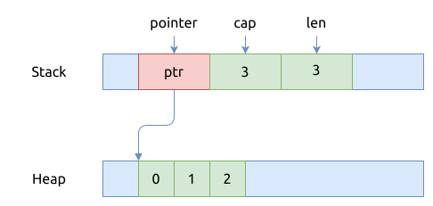
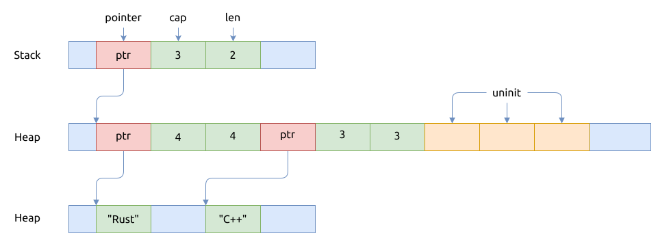

# 结构体定义与内存布局

`Vec<T>` vector 比较灵活, 里面的元素都在堆内存上分配.
[第三方库 smallvec](../../crates.io/smallvec.md) 提供了方法, 可以在栈上分配小容量的 vector, 对性能做了优化.

下面的代码片段展示了 `Vec<T>` 在标准库中的定义:

```rust, no_run
pub struct Vec<T> {
  buf: RawVec<T>,
  len: usize,
}

pub(crate) struct RawVec<T> {
  ptr: Unique<T>,
  cap: usize,
}

#[repr(transparent)]
pub struct Unique<T: ?Sized> {
  pointer: NonNull<T>,
  _marker: PhantomData<T>,
}

#[repr(transparent)]
pub struct NonNull<T: ?Sized> {
  pointer: *const T,
}
```

可以看到, 它主要有三部分组成:

- `pointer`: 指向堆内存的指针
- `cap`: 当前分配的堆内存最多能存放的元数个数
- `len`: 当前在堆内存中存放的有效元素的个数

举个例子, `let numbers: Vec<i32> = vec![0, 1, 2];` 的内存布局如下:



而下面的 `names` 对象的内存布局要更加复杂:

```rust
let mut names = Vec::with_capacity(3);
names.push("Rust".to_owned());
names.push("C++".to_owned());
assert_eq!(names.len(), 2);
assert_eq!(names.capacity(), 3);
```

