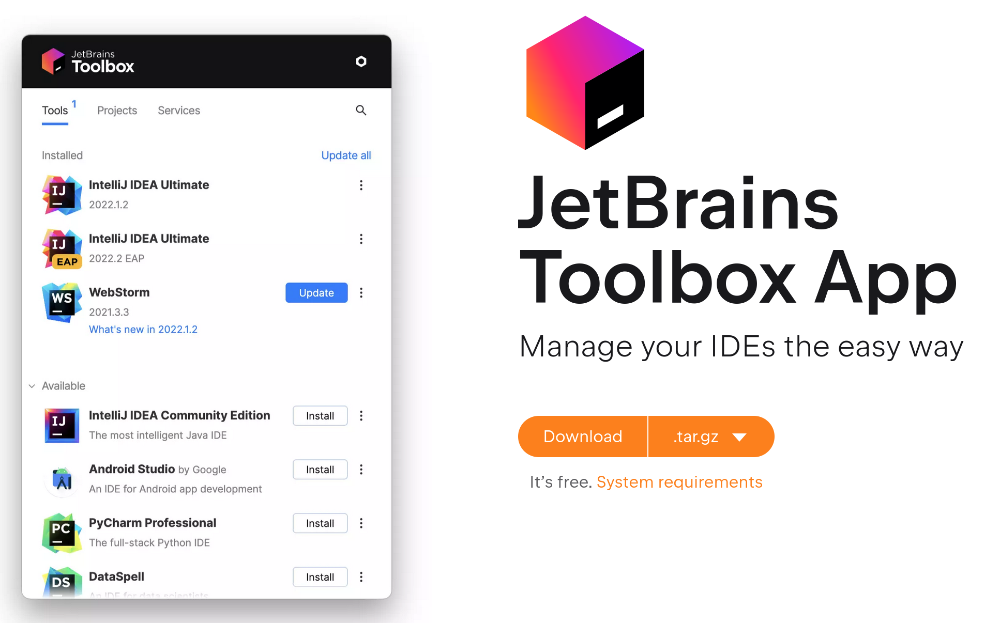
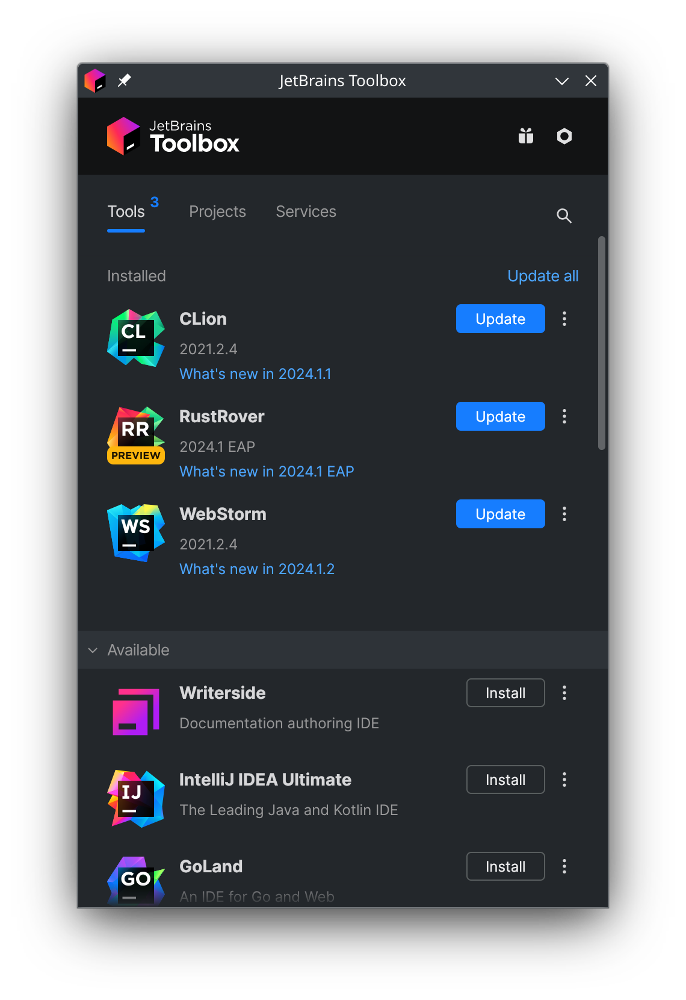
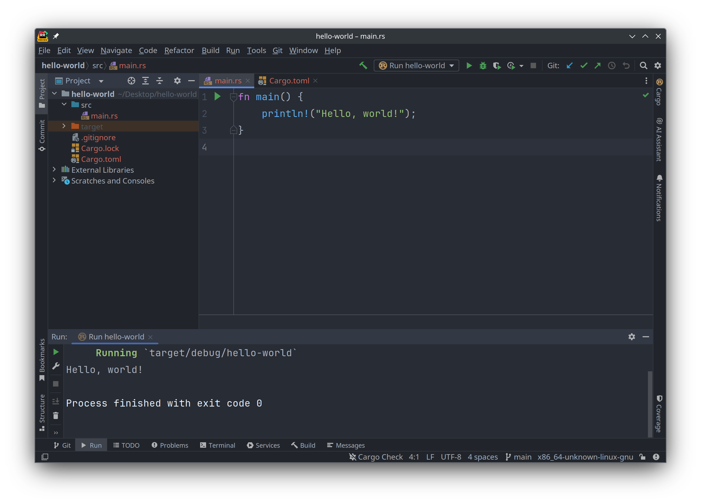
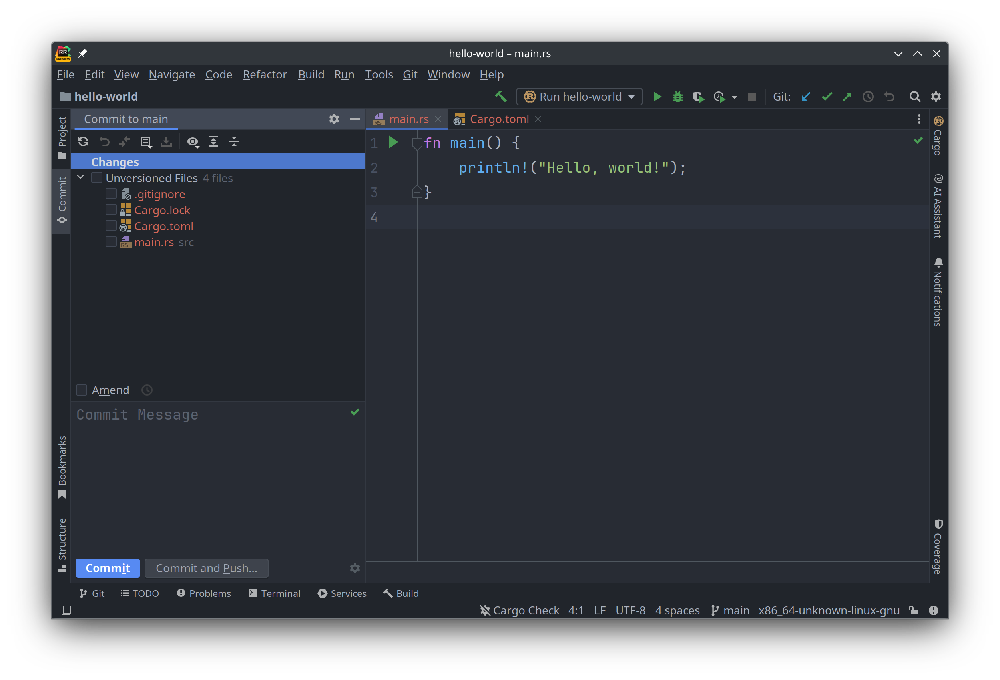

# RustRover IDE

[RustRover](https://www.jetbrains.com/rust/) 是 JetBrains 推出的一款 Rust IDE 工具, 我认为它是目前最易用的.
它几乎开箱即用, 不需要单独的配置. 但因为 IDE 使用了 Java 编写, 有时反应会慢一些, 并且比较消耗内存.

安装 [Toolbox App](https://www.jetbrains.com/toolbox-app), 用它来安装并更新 JetBrains 所有的 IDE 工具.

下载 toolbox app 并安装之后, 它会自动启动, 界面如下图所示:

在 IDE 列表里面选择 RustRover 并安装, 等待一会儿后就安装成功了, 点击 RustRover 的图标来启动它.
然后在 RustRover 里打开我们刚刚创建的 `hello-world` 项目:

可以在源码编辑区域编写代码, 然后点击工具栏上面的那个绿色的"运行"安钮 ▶️, 就可以运行代码:

仔细观察可以发现, 在窗口左侧侧边栏里显示的源代码目录结构, 其文件名都是橘红色的.
因为它们都是新创建的, 还没有保存到 git 里, 可以在合适的时候把修改的代码提交到 git 仓库:

在 RustRover 里面调试代码也很方便, 首先在源代码编辑窗口的左侧, 加入一个断点 (breakpoint),
然后点击工具栏上的"以调试方式运行"的绿色按钮 🪲, 就可以打开调试模式, 在该模式下可以查看本地变量,
内存区块中的值, 以及手动执行 lldb 调试器:

