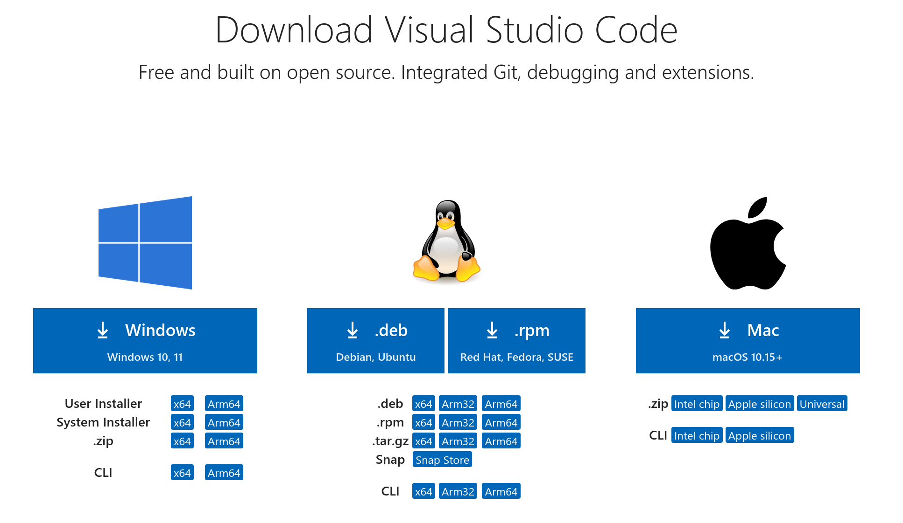
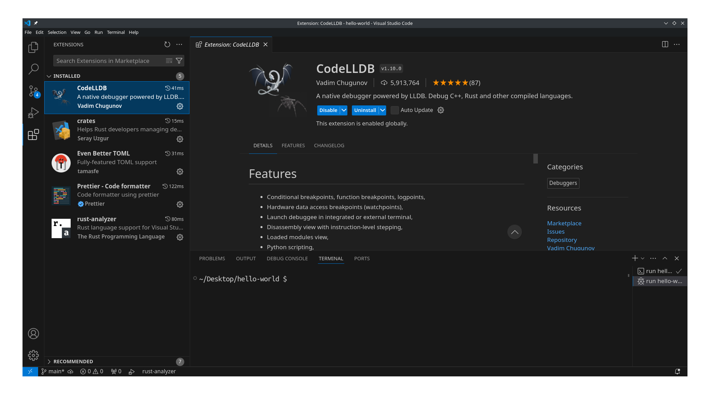
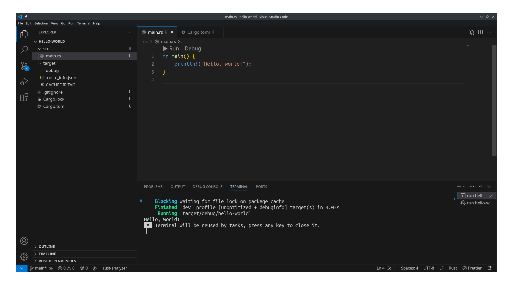
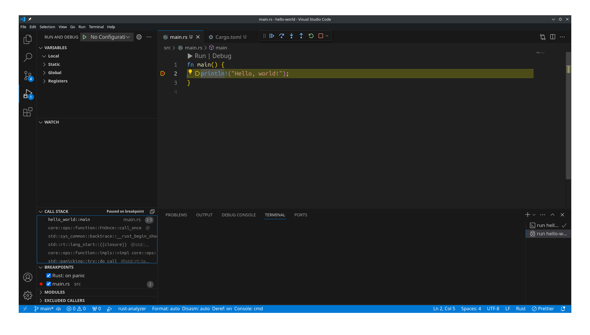
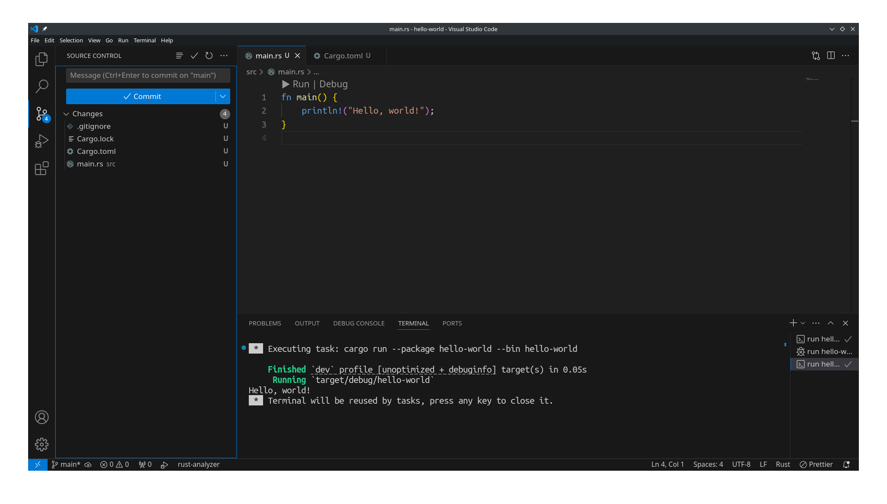

# VS Code

VS Code 是微软主导开发并且开源的一款跨平台的相对轻量级的文本编辑器, 但是它支持安装扩展.
安装几个扩展包后, 可以把它拼装成 Rust IDE.

访问[官方网站](https://code.visualstudio.com/Download), 下载与操作系统兼容的版本:

安装好之后, 就可以打开它了, 它的界面比较简洁. 首先给它安装扩展, 在窗口左侧栏, 切换到管理扩展的标签,
然后依次搜索并安装以下扩展包:

- [Even Better TOML](https://marketplace.visualstudio.com/items?itemName=tamasfe.even-better-toml), 编辑 toml 文件
- [rust-analyzer](https://marketplace.visualstudio.com/items?itemName=rust-lang.rust-analyzer), Rust 语言服务器
- [crates](https://marketplace.visualstudio.com/items?itemName=serayuzgur.crates), 管理 crates 里的依赖包
- [Prettier-Code Formatter](https://marketplace.visualstudio.com/items?itemName=esbenp.prettier-vscode), 代码格式化工具
- [CodeLLDB](https://marketplace.visualstudio.com/items?itemName=vadimcn.vscode-lldb), 支持 LLDB 调试器

安装好扩展之后, 大概是这个样子的效果:

现在就可以用 VS Code 打开 `hello-world` 项目目录了. 打开项目后, 打开 `src/main.rs` 源码文件,
并点击"运行"按钮, 就可以运行程序了, 一切正常的话, 会在窗口下半部的终端标签里, 输出 "Hello, world!":

上面已经安装了 CodeLLDB, 可以用它来启动调试模式. 首先在源代码编辑窗口的左侧栏, 用鼠标点击加入一个新的断点;
再点击窗口上的"调试"按钮, 就会进入调试模式:

VS Code 自带了对 git 源代码托管工具的支持, 在 VS Code 窗口左侧栏, 切换到"源代码管理"标签, 它会列出来哪些
文件做了修改在等待提交:

