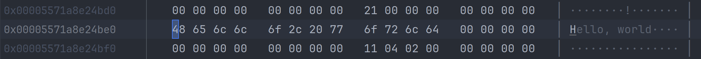

# 内存布局 Memory Layout

与其它数据类型相比, 枚举类型的内存布局比较复杂, 接下来我们分别说明.

## 只有枚举项标签

```rust
pub enum Weekday {
    Monday,
    Tuesday,
    Wednesday,
    Thursday,
    Friday,
    Saturday,
    Sunday,
}
```

这里, `Weekday` 类型占用1个字节的内存.


随着元素个数的增加, 可以占用2个字节或者更多.
比如下面的例子, 编译器会给它分配2个字节, 因为有太多枚举项了:

<details>
<summary><code>enum TooManyTags</code></summary>

```rust
{{#include assets/too-many-tags.rs:5: }}
```

</details>

## 显式地指定字节数

C++ 中, 可以显式地指定其数据类型, 以便确定占用的字节数. 下面的代码片段, `Weekday` 中的枚举项就会占用4个字节:

```cpp
enum class Weekday : uint32_t {
  Monday,
  Tuesday,
  Wednesday,
  Thursday,
  Friday,
  Saturday,
  Sunday,
};
```

Rust 中可以这样写:

```rust
{{#include assets/weekday.rs:5: }}
```

它们这些枚举项都占用4个字节, 尽管一个字节足够存储它们的值.


## 混合类型

枚举项标签内, 还包含了其它类型的数据.

enum 也可以使用不同的类型作为其元素. 比如:

```rust
{{#include assets/web-event.rs:5: }}
```

这里, `WebEvent` 类型占用的内存, 基于其子元素所占内存的最大值, 这里就是 `Click`. 同时要考虑到内存对齐 (alignment) 的问题.
它里面的枚举ID只占用了一个字节, 但是还有3个字节作为填充(padding).


## 包含一个指针类型 - 空指针优化

enum<T> 对于T里包含有指针类型时, 有独特的优化.

```rust
{{#include assets/web-event2.rs:5: }}
```

这里, `Paste(String)`, 内部包含了一个 `String` 对象, 而 String 对象里有一个指针, 指向了堆内存, 用于存放字符串的内容.

下图就是这个枚举类的内存分布情况:


可以看到, `paste` 对象第一个值包含的就是 `String` 对象里的那个指向堆内存的指针:



同时, 除了 `Paste(String)` 之外的其它枚举项, 里面的枚举ID只占了一个字节, 还有7个字节用于填充(padding), 填充项的第7个字节,
被强制设置成了 `0x80`, 这个就是用于标记一个无效指针地址的, 即所谓的空指针优化.

比如 `click` 对象的枚举ID以及填充字节加在一起是8个字节. 它的值是:
`0x80000000 00000004`, 这不是一个有效的内存地址! 因为内存地址不高于 `0x00007fff ffffffff`.
表示这仅仅是一个枚举项的ID, 而不是一个内存地址. 除了 `Paste(String)` 外的其它几个枚举项, 都是这样的布局!

编译器就是利用这种手段, 在枚举中对有一个指针的对象做了优化.
像上面的例子中: `assert_eq!(size_of::<String>(), size_of::<WebEventWithString>());`

## 包含多个指针类型

如果一个枚举项中, 有多于一个枚举项里含有指针, 那个上面介绍的对指针的优化方法就不再适用了. 因为加 `0x80` 前缀的方法不能区别多个内存地址.

看下面的代码示例:

```rust
{{#include assets/web-event3.rs:5: }}
```

这个枚举类的内存反而简单了一些:


因为不存在对指针的优化, `Paste(String)` 和 `Copy(String)` 的枚举ID也被设置了, 它占用一个字节, 同时有7个字节的填充(
padding).

这里, 使用 `WebEventWithMoreStrings::tag()` 方法就可以从各个枚举项里解析出枚举ID:

```rust, ignore
assert_eq!(keypress.tag(), 2);
assert_eq!(paste.tag(), 3);
assert_eq!(copy.tag(), 4);
assert_eq!(click.tag(), 5);
```