# 匹配 match

match 表达式与 C/C++ 中的 switch/case 语句类似, 用于匹配多个分支条件.

它的语法如下所示:

```rust, ignore
match value {
  pattern1 => expr1,
  pattern2 => expr2,
  ...
}
```

注意上面每个分支匹配表达式是以逗号 `,` 结尾的, 如果该表达式是块表达式 (block expression), 这个逗号就可以省略不写.
match 语句中的匹配优先级是根据分支顺序来确定的, 即优先检查第一条分支条件 `pattern1` 是否匹配, 如果匹配则执行 `expr1`
表达式, 并跳过剩下的所有分支. Rust 要求这些分支中必须有一条被匹配成功, 比如, 如果枚举中的条目没有被完全匹配到的话,
编译器就会报错:

```rust
{{#include assets/match-weekday.rs:5: }}
```

上面的代码中, 最后两条可以合并在一起, 作为一个分支; 或者使用通配符匹配.
match 只能在最后一个分支使用通配符匹配 (wildcard pattern), 表示无条件匹配这个分支,
类似于 C 语言 switch/case 中的 `default`. 先看一个简单的用例:

```rust
use std::env;

fn main() {
{{#include assets/match-num.rs:5: }}
```

用 C 语言来描述相同的功能, 大概如下:

```C
{{#include assets/switch-case.c:5:30 }}
```

后文有单独的章节介绍 [模式匹配](../pattern-matching/index.md) 更多功能和写法.

## 跳转表 Jump Table

跳转表 Jump Table, 又称作 分支表 Branch Table, 是对分支语句的一种优化手段.

下面的代码用于本次验证:

```rust
{{#include assets/jump-table.rs:5: }}
```

是上面的是 `with_if_else()` 函数, 它里面的分支语句比较多, 生成的部分 x86_64 汇编代码如下:

```assembly
{{#include assets/jump-table-x86_64.s:1370:1426 }}
```

可以看到, `with_if_else()` 函数, 使用 `if/else` 语句判断 `num` 变量时, 使用多次跳转才能匹配到
`else` 分支, 跳转次数越多, CPU 执行指令的效率越低.

接下来看 `with_match_short()` 函数, 它内部使用了 match 表达式来匹配 `num` 的值,
生成的汇编代码片段如下:

```assembly
{{#include assets/jump-table-x86_64.s:1518:1548 }}
```

从上面的汇编代码可以看到, 汇编器并没有生成跳转表, 也都只是一些条件判断语句,
需要多次判断用跳转才能到达最后一个分支.
但这部分代码要比 `with_if_else()` 的汇编代码更简洁, 执行效率也会更高.

只有分支语句达到某个限制时, 汇编器才会生成跳转表; 在 x86_64 上, 这个分支个数是4.
接下来看 `with_match_long()` 函数的汇编代码, 它就被构造出了跳转表:

```assembly
{{#include assets/jump-table-x86_64.s:1650:1679 }}

// 定义的跳转表
{{#include assets/jump-table-x86_64.s:1714:1721 }}
```

下图展示了跳转表的基本结构, 与 if/else 语句相比, 分支越多, match 表达式的执行效率相对越高.



另外, 在 aarch64 平台编译器也有类似的行为, 下面的汇编代码片段展示了 `with_match_long()` 函数:

```assembly
{{#include assets/jump-table-aarch64.s:1836:1874 }}

// 定义的跳转表
{{#include assets/jump-table-aarch64.s:1919:1926 }}
```

## 参考

- [wikipedia](https://en.wikipedia.org/wiki/Branch_table)
- [Thuc Le 的博客](https://thuc.space/posts/jump_table/)
- [‘Switch’ in C – Jump table formation](https://remyaraj89.wordpress.com/2010/11/05/switch-in-c-jump-table-formation/)