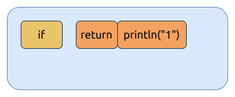

# 返回表达式 return

`return` 表达式用于函数或者闭包 (closure)中, 从当前函数上下文退出, 返回到函数调用处.

如果函数的返回值为空, 它返回的是 `()`, 即所谓的 `unit struct`, 类似于 C 语言中的 `void`. 比如:

```rust, ignore
fn do_some() -> () {
  ...
  return;
}
```

类似于:

```C, ignore
void do_some() {
  ...
  return;
}
```

如果 `return obj;` 表达式是函数中最后一个表达式, 那么 `return` 表达式中可以简写为 `foo`, 看个例子:

```rust
fn max_num(a: i32, b: i32) -> i32 {
  if a > b {
    return a;
  } else {
    return b;
  }
}
```

通常会被简写成以下形式:

```rust
fn max_num(a: i32, b: i32) -> i32 {
  if a > b {
    a
  } else {
    b
  }
}
```

## return 表达式的优先级

先看一个基于 [RustQuiz#20](https://dtolnay.github.io/rust-quiz/20) 修改的示例程序,
考虑考虑程序运行的结果是什么样的:

```rust
{{#include assets/return-if.rs:5: }}
```

其中, `return1()` 函数的 MIR 代码如下:

```rust, ignore
{{#include assets/return-if.mir:3:34 }}
```

再看一下 `return2()` 函数的 MIR 代码:

```rust, ignore
{{#include assets/return-if.mir:102:133 }}
```

对比 `return2()` 的 MIR 代码可以发现, 它与 `return1()` 的代码是相同的.
从这里我们可以学习到, `return` 表达式比 `if` 表达式有更高的优先级, 它优先与后面的表达式结合, 组合成 `return` 表达式,
并作为 `if` 表达式的条件 (condition).

如何理解呢? `return` 有更高的优先级, 它优先与大括号中的语句结合, 所以那个大括号是多余的,
`cargo clippy` 会给出相应的提示, 就像下图所示:

