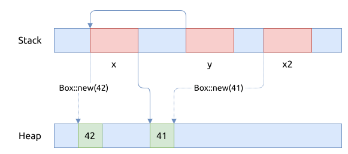

# Drop trait

`Drop` trait 在好些地方都有所提及, 但是它们的重点不太一样, 比如前文有介绍
[Drop trait](../common-traits/drop.md) 的基本用法, 以及 [所有权转移](../ownership/move.md).

在这一节中, 我们重点介绍 `Drop` trait 被调用的时机.

## 谁负责调用 Drop trait

编译器, 确且地说是编译器自动生成的汇编代码, 帮我们自动管理对像的释放, 通过调用 `Drop` trait.
就像在 C++ 语言中, 编译器会自动调用对象的析构函数.

但是, 跟 C++ 相比, Rust 管理对象的释放过程要复杂得多, 后者的对象会有 `未初始化 uninit` 的状态,
如果处于这个状态, 那么编译器就不会调用该对象的 `Drop` trait.

## 静态释放 static drop

表达式比较简单, 可以在编译期间确定变量的值是否需要被释放.

```rust
{{#include assets/static-drop.rs:5:}}
```

我们使用命令 `rustc --emit asm static-drop.rs` 生成对应的汇编代码,
下面展示了核心部分的代码, 并加上了几行注释:

```asm
{{#include assets/static-drop.s:605:702}}
```

阅读汇编代码时, 最好对比着 Rust 代码, 方便理解.

但是汇编代码有上百行, 我们把汇编代码转译成 C 代码, 大概如下:

```C
{{#include assets/static-drop.c:5:}}
```

这个过程就比较清晰了吧, 编译上面的 C 代码, 并且用 `valgrind` 或者 `sanitizers` 等工具检测,
可以发现它进行了两次堆内存分配, 两次内存回收, 没有发现内存泄露的问题.



## 动态释放 dynamic drop

表达式有比较复杂的分支或者分支条件在运行期间才能判定, 通过在栈内存上设置 `Drop Flag` 来完成.
程序运行期间, 修改 drop-flag 标记, 来确定是否要调用该对象的 `Drop` trait.

先看一个示例程序:

```rust
{{#include assets/dynamic-drop.rs:5:}}
```

可以看到, 只有在程序运行时, 才能根据当前的时间标签决定要不要初始化变量 x, 这种情况就要用到 `Drop Flag` 了.

上面的 Rust 代码生成的汇编代码如下, 我们加入了一些注释:

```asm
{{#include assets/dynamic-drop.s:799:969}}
```

其行为如下:

1. 栈空间初始化完成后, 就设置变量 x 的 `drop-flag = 0`
2. 然后计算当前的时间标签, 判断是否为偶数
    - 如果为偶数, 继续
    - 如果为奇数, 跳转到第4步
3. 分配堆内存, 并设置内存里的值为 `42`; 初始化 x, 并设置 `x.drop-flag = 1`
    - 组装参数, 调用 `print()` 打印字符串
4. 判断 `x.drop-flag == 1`, 如果是 `1`, 就调用 `Box::drop(&mut x)` 来释放它

我们将汇编代码的行为, 作为注释加入到原先的 Rust 代码中, 更方便阅读:

```rust
{{#include assets/dynamic-drop-noted.rs:5:}}
```

我们甚至可以将上面的汇编代码转译成对应的 C 代码:

```C
{{#include assets/dynamic-drop.c:5:}}
```

### 手动调用 `drop()` 函数

上面的代码演示了 `Drop Flag` 是如何工作的, 接下来, 我们看一下手动调用 `drop()` 函数释放了对象后,
它的行为是怎么样的?

先看示例代码:

```rust
{{#include assets/manual-drop.rs:5:}}
```

将上面的代码生成汇编代码, 我们还加上了几条注释:

```asm
{{#include assets/manual-drop.s:935:955}}
```

可以看到, 当执行到 `drop(x);` 时, 编译器:

- 先重置 `x.drop-flag = 0`
- 接着调用 `core::mem::drop(x);`

而编译器自动释放对象 `x` 时, 会调用另一个函数
`core::ptr::drop_in_place(*x as *mut i32)`.

将上面的汇编代码合并到之前的 Rust 代码, 大致如下:

```rust
{{#include assets/manual-drop-noted.rs:5:}}
```

## Drop 是零成本抽像吗?

我们分析了上面的 Rust 程序, 可以明显地发现, 编译器生成的代码在支持动态 drop 时, 需要反复地判断
drop-flag 是不是被设置, 如果被设置成1, 就要调用该类型的 `Drop` trait.

这种行为, 跟我们在 C 代码中手动判断指针是否为 NULL 是一样的, 每次给变量分配新的堆内存之前,
就要先判定一下它的当前是否为空指针:

```C
int* x;

if (x != NULL) {
  free(x);
}
x = malloc(4);
...
if (x != NULL) {
  free(x);
}
x = malloc(4);
...
```

但这些条件判断代码, Rust 编译器自动帮我们生成了, 而且可以保证没有泄露.

## 不要自动 Drop

到这里, 就要进入内存管理的深水区了, 上面提到了 Rust 会帮我们自动管理内存, 在合适的时机自动调用
对象的 `Drop` trait.

但与此同是, Rust 标准库中提供了一些手段, 可以让我们绕过这个机制, 但好在它们大都是 `unsafe` 的.

遇到这些代码, 要打起精神, 因为 Rustc 编译器可能帮不上你了.

### ManuallyDrop

ManuallyDrop 做了什么? 对于栈上的对象, 不需要调用该对象的 `Drop` trait.

先看一个 ManuallyDrop 的一个例子:

```rust
{{#include assets/manually-drop.rs:5:}}
```

上面的代码, 如果 `millis` 是偶数的话, x 会被标记为 `ManuallyDrop`, 这样的话编译器将不再自动
调用它的 `Drop` trait, 这里就会产生一个内存泄露点.

我们来看一下生成的汇编代码:

```asm
{{#include assets/manually-drop.s:799:1029}}
```

上面的汇编代码比较长, 将它的行为作为注释加到原先的 Rust 代码中, 更容易阅读:

```rust
{{#include assets/manually-drop-noted.rs:5:}}
```

### Box::leak

### ptr 模块

- write()
- copy()
- copy_nonoverlapping()
-

## 参考

- [Drop Flags](https://doc.rust-lang.org/nomicon/drop-flags.html)
- [Unchecked Uninitialized Memory](https://doc.rust-lang.org/nomicon/unchecked-uninit.html)