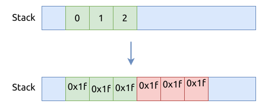
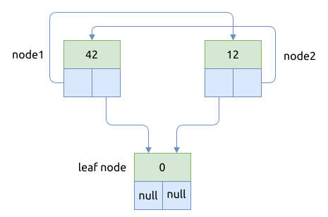

# Sanitizers

Sanitizers 是较轻量级的内存检测工具, 最初是在 C/C++ 编译器中实现的.

Rustc 支持的 sanitizer 种类有:

- [AddressSanitizer](https://clang.llvm.org/docs/AddressSanitizer.html), 选项名是 `address`, 支持检测以下问题:
    - 堆内存越界 (out-of-bounds of heap), 栈内存越界, 全局变量越界
    - 访问已被释放的内存 use after free
    - 重复释放的内存 double free
    - 释放无效内存 invalid free
    - 内存没有被释放, 造成泄露 memory leak
- [LeakSanitizer](https://clang.llvm.org/docs/LeakSanitizer.html), 选项名是 `leak`, 用于检测内存泄露,
  可以配合 `address` 选项使用
- [MemorySanitizer](https://clang.llvm.org/docs/MemorySanitizer.html), 选项名是 `memory`, 用于检测读取未初始化的内存
- [ThreadSanitizer](https://clang.llvm.org/docs/ThreadSanitizer.html), 选项名是 `thread`, 用于检测数据竞态 (data race)
- [ControlFlowIntegrity](https://clang.llvm.org/docs/ControlFlowIntegrity.html)
- [Hardware-associated AddressSanitizer](https://clang.llvm.org/docs/HardwareAssistedAddressSanitizerDesign.html)
- [KernelControlFlowIntegrity](https://clang.llvm.org/docs/ControlFlowIntegrity.html#fsanitize-kcfi)

目前只有 nightly 通道的 rust 工具链支持 Sanitizers, 使用 `-Z santizier=xxx` 来激活相应的工具.

## 检测内存泄露

比如, 下面的示例代码中有两个泄露位点:

```rust
{{#include assets/san-memory-leak.rs:5:}}
```

使用以下命令, 运行 sanitizer:

```bash
RUSTFLAGS="-Zsanitizer=address" cargo +nightly run --bin san-memory-leak
```

运行后产生了如下的日志:

```text
{{#include assets/san-memory-leak.san.log}}
```

尽管它成功检测出了两处内存泄露, 但是只有其中一个错误包含了精确的内存泄露位置:

- `#13 0x55da5c20ffff in san_memory_leak::main::hcfa228fc530e0524 /tmp/san-memory-leak.rs:8:15`

## 检测内存越界 Out of bounds

下面的代码示例中有三处内存越界发生:

```rust
{{#include assets/san-out-of-bounds.rs:5:}}
```

上面代码中对 `numbers` 的堆内存读写都是越界的:


对变量 `numbers2` 的栈内存写入也是越界的, 它只有 12 个字节的空间, 却写入了 24 个字节的数据:



使用以下命令, 运行 sanitizer:

```bash
RUSTFLAGS="-Zsanitizer=address,leak" cargo +nightly run --bin san-out-of-bounds
```

只有针对写堆内存越界的错误给出了精准的定位:

- `#2 0x55998e7730c7 in san_out_of_bounds::main::h3f63e38c2d1ef70e /tmp/san-out-of-bounds.rs:15:9`

## 访问已被释放的内存 use after free

以下的代码示例中, 错误地访问了已经被释放的堆内存:

```rust
{{#include assets/san-use-after-free.rs:5:}}
```

使用 address sanitizer 来检测它:

```bash
RUSTFLAGS="-Zsanitizer=address,leak" cargo +nightly run --bin san-use-after-free
```

得到如下的报告:

```text
{{#include assets/san-use-after-free.san.log}}
```

报告里面写明了错误类型 `heap-use-after-free`, 并精准定位了出错的位置:

- `#2 0x55c491d2a4be in san_use_after_free::main::ha6e8e0b3b7b7c0d4 /tmp/san-use-after-free.rs:14:9`

## 检测循环引用 Cyclic references

循环引用的问题常出现在 Rc/Arc 等以引用计数的方式来管理对象的地方.
以下一个示例展示了二叉树中的循环引用问题:

```rust
{{#include assets/san-cyclic-references.rs:5:}}
```

循环引用会导致节点上的对象不能被正常的释放, 内存不会回收并出现内存泄露的问题.



Sanitizer 可以检测到内存泄露的情况, 使用以下命令:

```bash
RUSTFLAGS="-Zsanitizer=address,leak" cargo +nightly run --bin san-cyclic-references
```

可以得到以下日志报告:

```text
{{#include assets/san-cyclic-references.san.log}}
```

报告中确实有发现内存泄露的情况, 并且给出了位置所在:

- `#5 0x55e9863c9fd2 in san_cyclic_references::main::h92fbd07b3584710d /tmp/intro-to-rust/code/memory/src/bin/san-cyclic-references.rs:33:17`
- `#5 0x55e9863ca05c in san_cyclic_references::main::h92fbd07b3584710d /tmp/intro-to-rust/code/memory/src/bin/san-cyclic-references.rs:38:17`

## 检测数据竞态 Data race

多个线程访问同一块内存时, 应该使用互斥锁等手段, 确保不会发生 data race condition.

另外, 如果使用了线程本地存储 (Thread local storage) 的话, 它在每个线程中被单独保存了一份,
各线程只会访问内部的那一份克隆, 所以不存在 data race.

看下面的例子:

```rust
{{#include assets/san-data-race.rs:5:}}
```

使用以下命令来检测它:

```bash
RUSTFLAGS="-Zsanitizer=thread" cargo +nightly run --bin san-data-race
```

会得到这个报告:

```text
{{#include assets/san-data-race.san.log}}
```

通过报告我们能发现, ThreadSanitizer 确实发现了 data race 问题:

- `Write of size 4 at 0x558040da1948 by thread T2`
- `  #0 san_data_race::main:: /tmp/san-data-race.rs:30:13 (san-data-race+0x98906)`
- `Previous write of size 4 at 0x558040da1948 by main thread:`
- `  #0 san_data_race::main:: /tmp//san-data-race.rs:34:14 (san-data-race+0x98e81)`

## 参考

- [sanitizers in rust](https://rustc-dev-guide.rust-lang.org/sanitizers.html)
