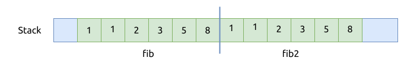

# 不需要转移所有权

## Copy trait

当一个类型实现了 `Copy` trait 后, 该类型的变量在赋值时, 进行的是复制的操作, 而不是转移（move）操作.

```rust
{{#include assets/copy-primitives.rs:5:}}
```

上面的代码很好地演示了基础类型字面量的拷贝, 在标准库中都为它们实现了 `Copy` trait.
这里的拷贝是将它们

这里类型包括:

- [整数类型](../primitives/integer.md)
- [浮点类型](../primitives/floating-point.md)
- [bool](../primitives/bool.md)
- [元组 tuple](../primitives/tuple.md), 要求元组中的元素也都是基础数据类型
- [数组 array](../primitives/array.md), 要求数组中的元素也都是基础数据类型
- [字符 char](../primitives/char.md)
- [切片 slice](../primitives/slice.md)
- [字符串字面量 string literal](../primitives/string-literals.md)

下面来解释一下数组的拷贝过程, 首先看看上面代码对应的汇编代码:

```rust
{{#include assets/copy-primitives.s:1316:1350}}
```

整个过程如下图所示:



## 如何"深拷贝" 字符串

前文演示了 C++ 中如何深拷贝一个字符串对象, 在 Rust 中实现同样的操作也很容易.