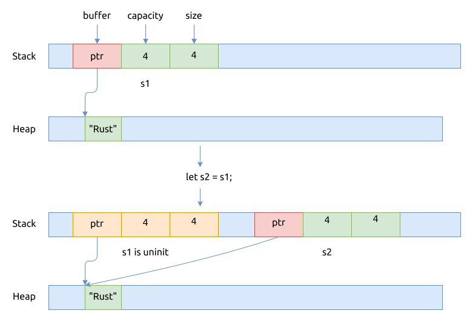

# 所有权转移 Move ownership

大多数类型, 在赋值, 函数参数及函数返回值时, 都是 move 的方式, 而不是拷贝的方式.
原变量的值的所有权转移给目标变量, 同时原变量成为未初始化, 也不再能被使用.

`let x = y; foo(x)` 当进行赋值及作为函数参数时, 变量的所有权就进行了传递.

传递所有权时, 可以更改值的可变性:

```rust, no_run
let x = Box::new(42i32);
let mut x2 = x;
```

## 转移所有权的实现

作为与上文中转移字符串的 C++ 代码的对应, 我们实现了相应的 Rust 代码, 看它是如何转移所有权的:

```rust
{{#include assets/move-string.rs:5:}}
```

使用命令 `rustc --emit asm move-string.rs` 可以生成相应的汇编文件,
我们摘取 `main()` 函数的代码并加上了一些注释, 可以对比上面的 rust 代码片段:

```asm
{{#include assets/move-string.s}}
```

根据上面的汇编代码指令, 我们画一下对应的图:



可以看到, s2 的栈内存数据都是从 s1 拷贝的, 但并没有拷贝它的堆内存, 这个属于浅拷贝 (shallow copy).

是函数结束前, 只调用了 `drop(s2)` 来释放 s2 的堆内存, 并没有调用 `drop(s1)` 来释放 s1 的堆内存, 为什么呢?

因为在哪里调用 `drop()` 函数, 以及是否调用 `drop()` 函数, 都是编译器在编译期间确定的.

例如上面的汇编代码就是编译器自动填充的:

```asm
{{#include assets/move-string.s:22:24}}
```

因为 s1 已经被编译器标记为 `未初始化 uninit`, 所以它不再能被使用, 也不必要调用 `drop(s1)` 释放它的内存.

与 drop 动作相关的更多细节, 我们在后面的 [Drop](../memory-basic/drop.md) 一节中有更全面和深入的介绍.

## 与 C++ 比较

可以看到, 在 Rust 中实现所有权的转移, 非常自然, 相对应的, 在C++中就需要:

- move constructor
- move assignment operator
- `std::move()`

与C++中的转移语言的不同点是:

- 在 C++ 中, `s1` 和 `s2` 字符串变量都是可以访问的, 在超出作用域后, 它们的析构函数都会被调用
- 在 Rust 中, 只有 `s2` 字符串可以被访问; 而 `s1` 已经被编译器标记为 `未初始化`, 所以它不能再被使用, 并且它也不会被 drop
- 在 C++ 中, 默认是深拷贝 (deep copy) 为主, 如果想要实现移动语义实现浅拷贝, 就需要用前文提到的方法修改代码
- 在 Rust 中, 默认实现的是移动语义, 如果想深拷贝, 就要显式地调用 `clone()` 方法

另外, 作为对比, 我们也实现一个 Person 类, 可以参看一下前文的 C++ 代码:

```rust
{{#include assets/move-person.rs:5:}}
```

## 参考

- [C++ 中的移动语义 Move Semantics](./move-in-cpp.md)
- [Drop](../memory-basic/drop.md)
- [不需要转移所有权](./clone-copy.md)