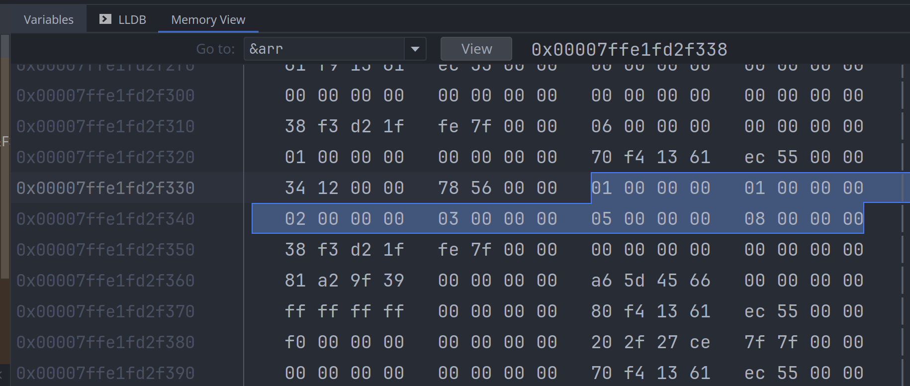

# 数组 Array

数组 (array), 用于存在固定长度的相同数据类型的列表.

```rust
let arr: [i32; 4] = [1, 1, 2, 3];
````

其类型声明可以写成:

```rust, ignore
pub use type Array<T, N> = [T; N];
```

数组内存是分配在栈空间的, 内存是连续分配的, 它的类型及大小是在编译期间就确定的.

`[T; N]` 在编译期确定元素类型及个数, 且元素个数不可变; 另外, 数组在编译期就需要初始化.

有两种方法来创建数组:

- 可以显式地指定所有元素的值, `let arr = [1, 2, 3, 4, 5];`
- 可以一次性初始化成相同的值, `let arr = [42; 100];` 会创建有100个元素的数组, 元素的值都是42

看下面的一个示例程序, 用于计算 10000 以内的所有质数:

```rust
{{#include assets/array-of-prime-numbers.rs:5: }}
```

## 数组的内存布局

以下面的代码片段作为示例:

```rust
{{#include assets/array-size.rs:5: }}
```

在调试器里查看 `arr` 的内存, 结果如下图:



看内存里的内容, 可以发现 `arr` 确实是一个存储相同元素大小 (i32) 连续内存块, 其占用的内存大小为
`4 * 6 = 24` 24个字节.

其它几个变量都是指针类型, 但里面的指针都指向的是 `arr` 的内存地址:

- `addr`, 直接调用 `addr_of!()` 宏, 返回对象的内存地址, 它不需要创建临时对象
- `arr_ref`, 是一个胖指针 (fat pointer), 是一个切片引用 `&[T]`, 除了包含 buffer 地址之外, 还存储了切片中元素的个数, 为6个
- `addr2`, 通过调用 `slice::as_ptr()` 方法, 创建一个切片临时对象, 并返回切片的 buffer 地址

把上面的内存块经过抽像处理后, 可以得到各变量的内存布局图:


另外, `arr` 是直接存储在进程的栈空间的, 并不是存放在堆内存上. 所以, 数组占用的空间不能太大,
否则会出现 `stack overflow` 等问题:

```rust
{{#include assets/array-overflow.rs:5: }}
```

这个程序会运行失败, 输出如下错误:

```bash
thread 'main' has overflowed its stack
fatal runtime error: stack overflow
Aborted (core dumped)
```

## 数组的常用方法

数组的操作方法, 比如 `arr.len()`, 都是隐式地将它先转换成相应的 [切片 slice](slice.md), 再调用切片提供的方法.

- `as_slice()`, `as_mut_slice()`, 显式地转换成切片 (`[T]`), 这样就可以调用切片的方法
- `each_ref()`, `each_mut()`, 转换成新的数组, 新数组中每个元素的值是对当前数组中同一个位置元素的引用

```rust
{{#include assets/array-of-string.rs:5: }}
```

## 参考

- [array](https://doc.rust-lang.org/stable/std/primitive.array.html)
- [切片 slice](./slice.md)