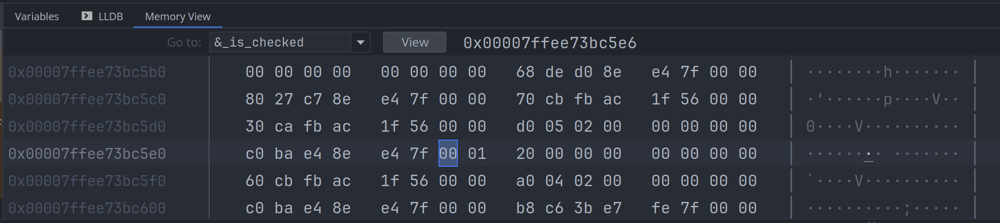

# 布尔类型

bool, 可以是 `true` 或 `false`, bool 占用一个字节, 即:

```rust
use std::mem::size_of;
assert_eq!(size_of::<bool>(), 1);
```

可以将 bool 值转换为整数, `true` 的值是 `1`, `false` 的值是 `0`. 但不能反过来将整数转为 bool 类型:

```rust
assert_eq!(true as i32, 1);
assert_eq!(false as i32, 0);
``` 

与 C++ 不同, `Vec<bool>` 并没有被单独优化.

## bool 的内存布局

bool 占用一个字节, 在二进制层面, 它只取两个值:

- `0b01` 表示 true
- `0b00` 表示 false

比如, 下面的代码:

```rust
fn main() {
  let _is_checked = false;
  let _is_hover = true;
}
```

我们在调试器检查, 它们的内存分别如下:



## 常用的函数

与 C/C++ 语言不同, Rust 为 bool 类型提供了一些好用的函数, 方便编写函数式风格的代码.

### then_some(t)

如果为 true, 就返回 `Some(t)`; 否则直接返回 `None`:

```rust
assert_eq!(false.then_some(0), None);
assert_eq!((1 + 1 == 2).then_some(2), Some(2));
```

### then(f)

如果为 true, 就执行函数并返回 `Some(f())`; 否则直接返回 `None`:

```rust
assert_eq!(false.then(|| 0), None);
assert_eq!(true.then(|| 0), Some(0));
```