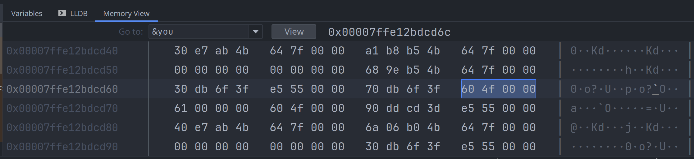

# 字符 char

char, 表示 Unicode 单个字符, 比如 `a`, 使用 32-bit 的空间, 即 4 个字节, 使用单引号引用.

```rust
use std::mem::size_of_val;
let char_a = 'a' as char;
assert_eq!(size_of_val(&char_a), 4);
```

一个 char 表示一个 Unicode code point, 范围是:

- 0x0000 - 0xD7FF
- 0xE000 - 0x10FFFF

只有 u8 类型可以用 `as` 来转换成 char.

## char 的内存布局

上面提到了, char 占用4个字节.
我们可以用代码来验证它:

```rust
{{#include assets/char-values.rs:5: }}
```

然后在调试器中, 分别查看两个变量的内存, 可以看到 `'你'` 的内存值是 `0b0000 4f60`:



而字符`'a'`的内存值是 `0b0000 0061`:


## char 的常用方法

- 大小写转换
    - `to_lowercase()`
    - `to_uppercase()`
    - `to_ascii_lowercase()`
    - `to_ascii_uppercase()`
    - `make_ascii_lowercase()`
    - `make_ascii_uppercase()`
- 从 `u32` 转成 char, 因为 char 的取值范围更小
    - `from_u32()`
    - `from_u32_unchecked()`
- 判断字符的范围
    - `is_alphabetic()`
    - `is_alphanumeric()`
    - `is_ascii_alphabetic()`
    - `is_ascii_alphabetic()`
    - `is_ascii()`
    - `is_control()`
    - `is_ascii_control()`
    - `is_digit()`
    - `is_ascii_digit()`
    - `is_lowercase()`
    - `is_uppercase()`
    - `is_ascii_lowercase()`
    - `is_ascii_uppercase()`
    - `is_whitespace()`
    - `is_ascii_whitespace()`

## char 转换为整数

- `to_digit(self, radix: u32) -> Option<u32>`, 将字符转换成 u32 类型的整数
- `is_ascii_digit(&self) -> bool`, 判断字符的范围是不是位于 `'0' ..= '9'`

## 参考

- [Unicode.org](https://home.unicode.org/)
- [char模块](https://doc.rust-lang.org/stable/std/char/index.html)
- [ascii模块](https://doc.rust-lang.org/stable/std/ascii/index.html)