# 浮点类型 Floating Point Numbers

与 C/C++ 一样, Rust 支持 IEEE 754 标准中要求的单精度 (single precision) 和双精度 (double precision) 浮点数,
分别是 f32 和 f64.

| 数据类型 | 精度  | C 语言中的类型 | 占用的字节数 |
|------|-----|----------|--------|
| f32  | 单精度 | float    | 4 字节   | 
| f64  | 双精度 | double   | 8 字节   |

## IEEE 754

IEEE 754 标准定义的浮点数, 在常见的编程语言中均有实现, 例如 c/c++/python/java/golang.

它规定了浮点数有三部分组成:

- 符号位 (Sign), 占用 1 bit, 0 代表正数, 1 代表负数
- 指数位 (Exponent), 指数部分,
- 有效位 (Mantissa), 或者称作有效位数, 或者尾数. 它是浮点数具体数值的表示

```text
(Sign) * Mantissa * 2 ^ (Exponent)
```

| 类型  | 符号位 Sign | 指数位 Exponent | 有效位 Mantissa | 偏移量 Bias      | 数值范围 Range               |
|-----|----------|--------------|--------------|---------------|--------------------------|
| 单精度 | 1 (第31位) | 8 (30-23位)   | 23 (22-0位)   | 127 = 2^8-1   | -3.4*10^38 到 3.4*10^38   |
| 双精度 | 1 (第63位) | 11 (62-52 位) | 52 (51-0位)   | 1023 = 2^12-1 | -1.8*10^308 到 1.8*10^108 |

总之, 32 比特的单精度浮点数的内存如下图所示:



64 比特的双精度浮点数的内存如下图所示:


特殊的浮点数值:

| 数值         | 符号位 | 指数位 | 有效位 | f32               | f64               |
|------------|-----|-----|-----|-------------------|-------------------|
| 0          | 0   | 0   | 0   | 0.0_f32           | 0.0_f64           |
| -0         | 1   | 0   | 0   | 0.0_f32           | 0.0_f64           |
| 无穷大 (∞)    | 0   | 255 | 0   | f32::INFINITY     | f64::INFINITY     |
| 负无穷 (−∞)   | 1   | 255 | 0   | f32::NEG_INFINITY | f64::NEG_INFINITY |
| 非浮点数 (NAN) | 0   | 255 | 非 0 | f32::NAN          | f64::NAN          |

## 浮点数常用的函数

- `sqrt()`, `cbrt()` , 计算浮点数的二次方根和三次方根
- `powi()`, `powf()`, 进行指数运算
- `exp()`, `exp2()`, 分别以自然常数e和2为底做指数运算
- `log()`, `log2()`, `ln()`, `log10()` 等, 做对数计算
- `sin()`, `cos()`, `tan()` 等, 做三角函数计算
- `round()`, `ceil()`, `floor()`, 浮点数四舍五入近似计算, 转为整数
- `is_finite()`, `is_infinite()`, `is_nan()` 等判断特殊整数
- `is_sign_negative()`, `is_sign_positive()`, `signum()` 等处理浮点的符号位
- `min()`, `max()`, `clamp()` 用于限制浮点数的取值范围

## 比较两个浮点数是否相等

两个浮点数之间并不能直接比较它们是否相等, 也不能直接判断一个浮点数是不是等于 `0.0`,
因为浮点数不是精确的数, 浮点数并没有实现 `Ord` trait.

`total_cmp()` 方法可以缓解一部分限制, 它基于 IEEE 754 中的 `totalOrder` 规则,
该方法常用于浮点数的排序.

```rust
{{#include assets/float-total-cmp.rs:5: }}
```

有时还需要比较浮点数值之间是不是近似相等:

```rust
{{#include assets/float-nearly-equal.rs:5: }}
```

或者使用第三方库 [float_cmp](https://docs.rs/float-cmp/latest/float_cmp/).

## 参考

- [IEEE754 on wikipedia](https://en.wikipedia.org/wiki/IEEE_754)
- [Scientific notation](https://en.wikipedia.org/wiki/Scientific_notation)
- [你应该知道的浮点数基础知识](https://cenalulu.github.io/linux/about-denormalized-float-number/)