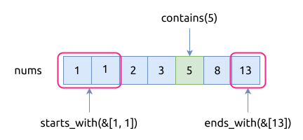
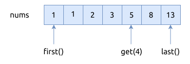
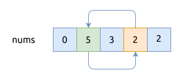
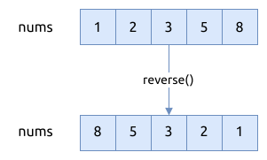
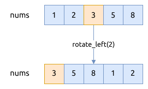
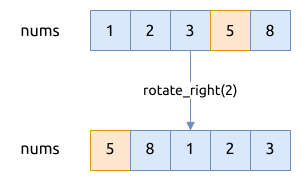
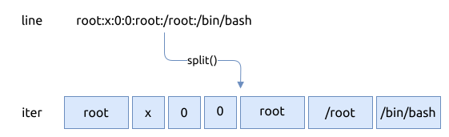
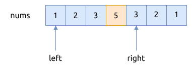
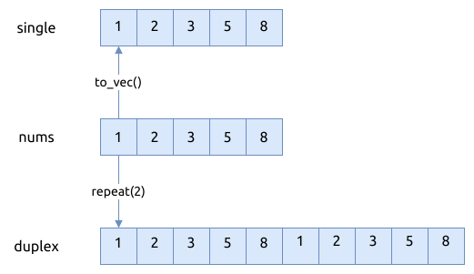

# 切片 slice

切片 slice, 可以认为是对连续存储元素的访问代理 (比如 `[T; N]` 或者 `Vec<T>`), 本身并不存储实际的数据,
即它只是对原有数据的引用, 并不拥有所有权.
它是一种动态大小的类型(dynamic sized type), 即在编译期不能确定所占用的内存大小. 它的类型是: `[T]`.

切片写作 `[T]`, 只指定了元素类型, 并没有指定其长度; 所以它不能直接存储为变量或作为函数参数, 而应该以引用的方式来使用,
否则会遇到类似 `"doesn't have a size known at compile-time"` 的报错.

常用的切片引用形式有以下三种:

- `&[T]`, 共享引用的切片(shared slice), 通常我们所说的切片就是这种, 它表示不可变切片, 一个值可以有多个不可变切片,
  因为它们都是只读的
- `&mut [T]`, 可变引用切片, 可以改变切片中元素的值, 它表示可变切片, 即可修改元素的值. 一个值只能最多有一个可变切片
- `Box<[T]>`, boxed slice, 后面的章节会有详细的介绍

共享引用切片, 属于一种胖指针 (fat pointer), 有两部分组成:

- 指向具体数据的一个指针
- 可以访问的元素数目, 类型是 usize

可以将数组通过引用的方式自动转为 slice:

```rust
let xs = [42u64; 10];
let s = &xs;
```

也可以指定数据代理访问的范围, 即只允许访问其部分元素:

```rust
let xs = [42; 10];
let s = &xs[1..5];
```

数组 array 可以直接转换成数组切片:

```rust
fn do_something(slice: &[i32]) { }

let xs = [1, 1, 2, 3, 5];
do_something(&xs);
```

也可以只将数组中的一部分元素转为切片:

```rust
fn do_something(slice: &[i32]) { }

let xs = [1, 1, 2, 3, 5];
do_something(&xs[1..3]);
```

动态数组(vector) 也可以转换成切片:

```rust
let nums: Vec<i32> = vec![1, 1, 2, 3, 5, 8];
let part: &[i32] = &vec[1..3];
assert_eq!(part, &[1, 2]);
```

在下一节还会介绍字符串切片(string slice).

## 切片的内存布局

以下面的代码片段为例, 来演示引用切片的内存布局.

```rust
{{#include assets/slice-values.rs:5: }}
```

上文已经提到了, 引用切片 `&[T]` 是一个胖指针, 包含两个部分:

- 指向 buffer 的指针
- 连续存储的元素个数


## 切片常用方法

切片本身提供了很丰富的函数, 操作数组(array), 动态数组(vector)以及字符串时, 会非常频繁地使用这些接口.

### is_empty(), len()

这两个函数都会访问切片的 `length` 属性, 使用方法也很简单. 但有一点要注意的, 这两个函数都是常量函数.

```rust, ignore
pub const fn len(&self) -> usize;
pub const fn is_empty(&self) -> bool;
```

### as_ptr(), as_mut_ptr()

这两个函数将引用切片转换成原始指针, 原始指针指向的内存地址就是切片的 `buffer ptr` 属性指向的地址,
它们返回的指针类型分别是 `*const T` 和 `*mut T`.

```rust
{{#include assets/slice-as-ptr.rs:5: }}
```

### iter(), iter_mut()

这一组函数获取切片的迭代器, 它们经常被使用, 分别返回不可变更迭代器 (immutable iterator) 和可变更迭代器.

```rust, ignore
pub fn iter(&self) -> Iter<'_, T>;
pub fn iter_mut(&mut self) -> IterMut<'_, T>;
```

上面 `as_mut_ptr()` 的示例代码, 可以用迭代器来重写:

```rust
{{#include assets/slice-iter.rs:5: }}
```

### contains(), starts_with(), ends_with()

这一组函数用于检查切片中是否包含某个或某些元素:

```rust, ignore
pub fn contains(&self, x: &T) -> bool where T: PartialEq;
pub fn ends_with(&self, needle: &[T]) -> bool where T: PartialEq;
pub fn starts_with(&self, needle: &[T]) -> bool where T: PartialEq;
```

- `contains()`, 遍历切片, 依次检查元素是否与给定的值相等, 时间复杂度是 `O(n)`
- `starts_with()`, 检查切片是否以某个子切片开始, 用于判断前缀
- `ends_with()`, 检查切片是否以某个子切片结尾, 用于判断后缀

看下面的示例代码:

```rust
{{#include assets/slice-contains.rs:5: }}
```

操作过程如下图所示:



### get(), get_mut(), first(), first_mut(), last(), last_mut()

这一组方法用于获取切片中某个索引位置的元素, 它们都会返回 `Option<T>` 值, 因为不确定索引是否有效.

```rust, ignore
pub fn get<I>(&self, index: I) -> Option<&<I as SliceIndex<[T]>>::Output>
  where I: SliceIndex<[T]>;
pub fn get_mut<I>(&mut self, index: I) -> Option<&mut <I as SliceIndex<[T]>>::Output> 
  where I: SliceIndex<[T]>;
pub const fn first(&self) -> Option<&T>;
pub fn first_mut(&mut self) -> Option<&mut T>;
pub const fn last(&self) -> Option<&T>;
pub fn last_mut(&mut self) -> Option<&mut T>;
```

- `get()` 和 `get_mut()`, 需要指定元素的索引位置, 分别返回不可变引用和可变引用
- `first()` 和 `first_mut()`, 返回切片中的第一个元素, 如果切片是空的, 就返回None
- `last()` 和 `last_mut()`, 返回切片的最后一个元素, 如果切片是空的, 就返回 None

看一下示例程序:

```rust
{{#include assets/slice-get.rs:5: }}
```

操作过程如下图所示:



### swap(), swap_with_slice()

这一组方法用于交换切片中的元素, 但它们有明显的区别:

- `swap()` 用于交换切片内的不同位置的元素
- `swap_with_slice()` 用于交换两个相同长度的切片的所有元素

```rust, ignore
pub fn swap(&mut self, a: usize, b: usize);
pub fn swap_with_slice(&mut self, other: &mut [T]);
```

以下代码片段演示了 `swap()` 的用法:

```rust
let nums = [0, 5, 3, 2, 2];
nums.swap(1, 3);
assert_eq!(nums, [0, 2, 3, 5, 2]);
```

交换的方式如下图所示:



比如, 下面的插入排序算法就会频繁地调用 `swap()` 方法:

```rust
{{#include assets/insertion-sort.rs:5: }}
```

### reverse(), rotate_left(), rotate_right()

这一组函数用于批量移动切片中的元素, 它们的函数声明如下:

```rust, ignore
pub fn reverse(&mut self);
pub fn rotate_left(&mut self, mid: usize);
pub fn rotate_right(&mut self, k: usize);
```

其中, `reverse()`, 原地前后互转切片中的所有元素, 第一个元素与最后一个互换, 第二个元素与倒数第二个互换, 以此类推.
看一个 `reverse()` 的示例:

```rust
{{#include assets/slice-reverse.rs:5: }}
```

过程如下图所示:



函数 `rotate_left(mid)`, 将所有的元素原地左移 `mid` 个位置, 这样的话原本处于 `mid` 位置的元素就被移到了左侧第一个位置.
看一个示例程序:

```rust
{{#include assets/slice-rotate-left.rs:5: }}
```

整个过程如下图所示:



函数 `rotate_right(k)`, 将所有的元素原地右移 `k` 个位置, 这样的话原本处于从右数第 `k` 个位置的元素就被移到了左侧第一个位置.
看一个示例代码:

```rust
{{#include assets/slice-rotate-right.rs:5: }}
```

整个过程如下图所示:



### split(), split_at(), split_at_mut()

这一组函数将切片分隔开来. 它们的函数声明如下:

```rust, ignore
pub fn split<F>(&self, pred: F) -> Split<'_, T, F> ⓘ
    where F: FnMut(&T) -> bool;
pub const fn split_at(&self, mid: usize) -> (&[T], &[T]);
pub fn split_at_mut(&mut self, mid: usize) -> (&mut [T], &mut [T]);
```

其中 `split()` 以给定的函数来分隔切片, 并返回一个迭代器. 看一个例子:

```rust
{{#include assets/slice-split.rs:5: }}
```

整个操作如下图所示:



而 `split_at()` 和 `split_at_mut()` 则把切片从某个索引位置分开, 分成左右两部分切片.
其中 `split_at()` 返回的都是不可变更切片, 而 `split_at_mut()` 则返回的是可变更切片.
下面看一个示例程序:

```rust
{{#include assets/slice-split-at-mut.rs:5: }}
```

切片的分隔情况如下图所示:



### sort(), sort_unstable()

对切片做排序, 其中:

- `sort()` 是稳定排序
    - 基于归并排序 (merge sort) 实现的
    - 时间复杂度是 `O(n * log(n))`
    - 空间复杂度是 `O(n)`
    - 如果切片中的元素比较少, 会使用插入排序代替
- `sort_unstable()` 是不稳定排序
    - 基于快速排序 (quick sort) 实现的
    - 时间复杂度是 `O(n * log(n))`
    - 空间复杂度是 `O(1)`

它们还有一些辅助函数, 可以指定排序函数, 比如 `sort_by()`, `sort_by_key()`.

下面展示一个示例程序:

```rust
{{#include assets/slice-sort.rs:5: }}
```

### binary_search(), binary_search_by(), binary_search_by_key()

这一组方法, 使用二分法查找切片中是否包含某个值, 在调用该函数前要确保切片中的元素已经被排序了, 否则该操作没有意义.
上面介绍的 `contains()` 方法是从头到尾线性遍历切片, 比较慢, 但是不要求切片是排序的.

```rust, ignore
pub fn binary_search(&self, x: &T) -> Result<usize, usize> where T: Ord;
pub fn binary_search_by<'a, F>(&'a self, f: F) -> Result<usize, usize> where F: FnMut(&'a T) -> Ordering;
pub fn binary_search_by_key<'a, B, F>(&'a self, b: &B, f: F) -> Result<usize, usize> where F: FnMut(&'a T) -> B, B: Ord;
```

可以看到, binary_search() 是要求类型 `T` 实现 `Ord` trait 的, 但有时切片中的类型并不会实现它, 比如浮点类型的 f32, f64.
为此, 我们可以使用该组中的其它函数来绕过限制, 可以看看下面的示例代码:

```rust
{{#include assets/slice-binary-search.rs:5: }}
```

### to_vec(), repeat()

这一组函数将切片转换成动态数组 `Vec<T>`.

`to_vec()` 将切片转换成数组, 并拷贝切片中所有的元素, 类似于这样写: `slice.iter().collect()`.

`repeat(n)` 将切片转换成数组, 并重复 `n` 次拷贝切片中的所有元素.

```rust, ignore
pub fn to_vec(&self) -> Vec<T> where T: Clone;
pub fn repeat(&self, n: usize) -> Vec<T> where  T: Copy;
```

看一个小例子:

```rust
{{#include assets/slice-to-vec.rs:5: }}
```

操作过程如下图所示:



### copy_from_slice(), clone_from_slice()

这一组函数用于批量替换切片中的元素, 它们的差别在于:

- `copy_from_slice()` 要求类型 `T` 实现 `Copy` trait
- `clone_from_slice()` 要求类型 `T` 实现 `Clone` trait

它们的函数声明如下:

```rust, ignore
pub fn copy_from_slice(&mut self, src: &[T]) where T: Copy;
pub fn clone_from_slice(&mut self, src: &[T]) where T: Clone;
```

要注意的是, 当前切片的长度应该等于源切片 `src` 的长度, 否则程序就会崩溃.

看一下示例程序:

```rust
{{#include assets/slice-clone-from-slice.rs:5: }}
```

### fill(), fill_with()

这一组函数用特定的值重新填充整个切片.

它们的函数声明如下:

```rust, ignore
pub fn fill(&mut self, value: T) where T: Clone;
pub fn fill_with<F>(&mut self, f: F) where F: FnMut() -> T;
```

- `fill(value)`, 使用给定的值来填充
- `fill_with(f)`, 调用指定的函数来填充

举一个例子:

```rust
{{#include assets/slice-fill.rs:5: }}
```

### concat(), join()
