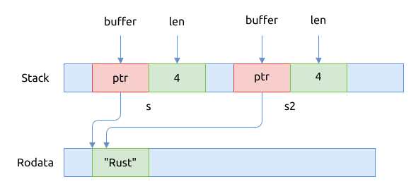

# 字符串 str

## 字符串切片 &str

## 字符串切片的内存布局

首先看一个小例子:

```rust
{{#include assets/string-mem-layout.rs:5:}}
```

可以看下生成的汇编代码:

```asm
{{#include assets/string-mem-layout.s:332:355}}

{{#include assets/string-mem-layout.s:413:418}}
```

上面的代码中, 先定义了一个字符串字面量, 并用它来初始化字符串切片 `s`,
字符串切片 `s` 的内存包含了两个部分:

- 指向字符串字面量内存的指针
- 以及字符串字面量的长度, 为4个字节

字符串字面量的值位于 `rodata` segment, 被嵌在了程序的二进制文件中, 在整个进程的运行期间它都是有效的.

