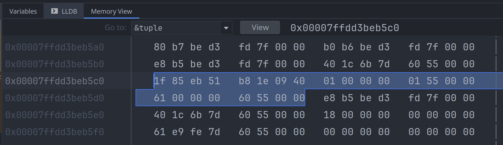
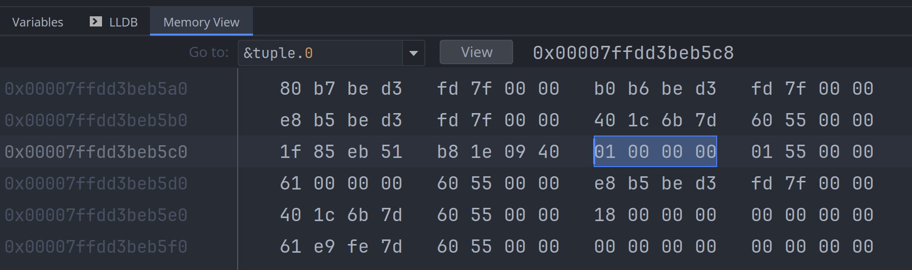
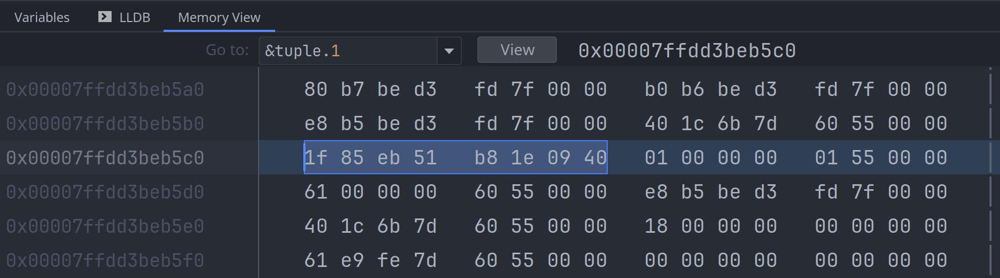
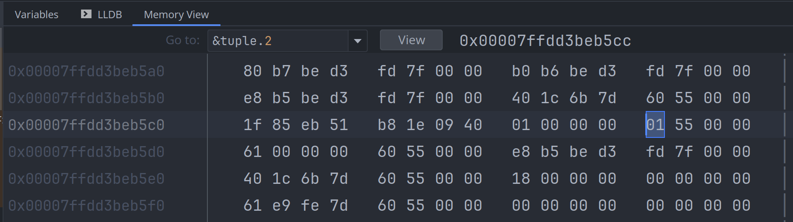
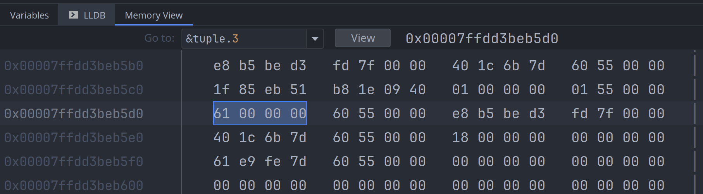

# 元组 Tuple

元组 tuple, 比如 `(1, 'a', 3.14, true)`, 用于存放定长的不同数据类型.

元组与数组 (array) 的比较:

- 可以组合各种不同类型的数据, 而数组只能存放相同类型的数据
- 与数组一样, 编译期即可确定其元素个数
- 与数组一样, 使用下标访问元素, 而不是像 struct 那样使用元素名来访问
- 常使用它做为函数返回值, 这样函数就可以返回多个不同类型的值

默认可以使用下标访问元组中的元素:

```rust
let tuple = (1, 'a', 3.14, true);
assert_eq!(tuple.0, 1);
assert_eq!(tuple.1, 'a');
assert!(tuple.3);
```

但下标的语法可读性并不好, 可以使用模式匹配的方式.
比如 `fn split_once(&self, delimiter: Pattern) -> Option<(&str, &str)>;` 用来分隔字符串:

```rust
let entry = "key=42";
if let Some((key, value_str)) = entry.split_once('=') {
  assert_eq!(key, "key");
  let value: i32 = value_str.parse().unwrap();
  assert_eq!(value, 42);
}
```

Rust 允许在使用逗号的地方, 在最后一个元素尾部多加一个逗号以方使书写. 比如:

- `fn foo(a: i32, b:i32,);`
- `(48, 42,)`
- `enum Colors { Red, Green, Blue, }`

## 空的元组 Unit type

空的元组不包含任何元素, 写成 `()`, 也称为 `unit type`, 有点类似于C中的 `void`.

比如, 一个函数如果没有任何返回值, 那它返回的就是 unit type, 它的返回值类型可以省去.

```rust
fn main() {
  println!("hello, world");
}
```

就相当于:

```rust
fn main() -> () {
  println!("hello, world");
}
```

## tuple 的内存布局

先看下面的示例代码:

```rust
{{#include assets/tuple-values.rs:5: }}
```

整个元组的内存布局情况如下图所示, 一共占用了24个字节:



先查询第一个元素, `tuple.0` 是一个整数, 占4个字节:



接下来查询第二个元素, `tuple.1` 是一个双精度浮点值, 占用8个字节:



可以看到 `tuple.0` 和 `tuple.1` 在内存中的顺序与在代码声明里的顺序是相反的, 这个是 rustc 编译器
自行处理的, 这是与C/C++编译器不一样的地方, rustc 不保证元素在内存中的实际顺序与其声明顺序一致.

再来看第三个元素, `tuple.2`, 是一个布尔值, 它本身只占1个字节:



最后一个元素, `tuple.3`, 是一个字符, 占用4个字节:



上面例子中, 元组里每个元素占用的字节数加起来是 `4 + 8 + 1 + 4 = 17` 17个字节; 但整个元组为什么
占用了24个字节呢? 这个与内存对齐 (memory alignment) 有关系:

- 尽管 `tuple.2` 是 `bool`类型, 但它占了4个字节, 其中的3个字节用作填充 (padding)
- `tuple.3` 是 `char` 类型, 它本身只需要4个字节, 但它后面又多出了4个字节, 后面的4个字节也被用作填充


