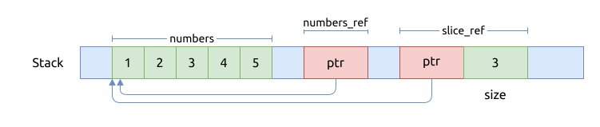
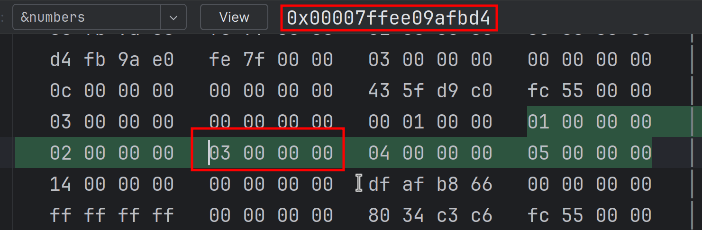
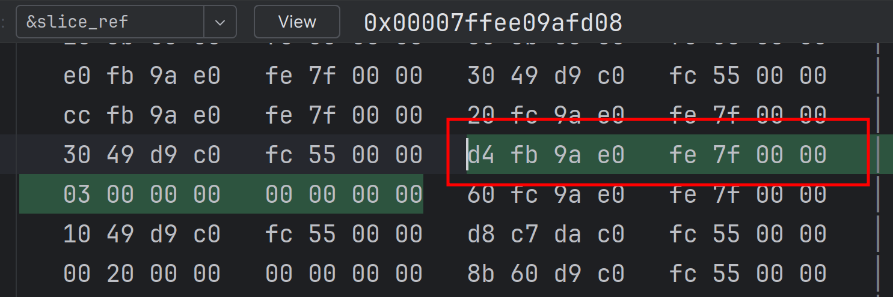

# 引用的内存结构 Memory layout

Rust 中的引用, 跟 C++ 中的引用一样, 在底层都是指针.

先看一段代码 C++ 代码片段:

```C++
{{#include assets/reference-address.cpp:5:}}
```

这段 C++ 代码对应的汇编代码如下:

```assembly
{{#include assets/reference-address-cpp.s}}
```

然后我们用 C 语言重新写一遍相同的功能, 如下:

```C
{{#include assets/reference-address.c:5:}}
```

这段 C 代码对应的汇编代码如下:

```assembly
{{#include assets/reference-address-c.s}}
```

可以发现, 两段汇编代码是完全一样的. 简单地说, <b>C++中的引用, 在底层就是通过指针实现的.</b>

最后, 我们看一下对应的 Rust 代码如何写:

```rust
{{#include assets/reference-address.rs:5:}}
```

当然, 也要把它生成汇编代码:

```assembly
{{#include assets/reference-address-rs.s}}
```

可以看到, 生成的汇编代码里压根就没有用到 `x_ref` 这个引用. 这是因为表达式太简单, 被优化掉了,
我们使用 `rustc --emit asm -g reference-address.rs` 重新生成汇编, 得到以下内容:

```rust
{{#include assets/reference-address-rs2.s}}
```

上面几行重要的汇编代码都加了注释, 可以看到:

- `x_ref` 存储的也是 `x` 的内存地址

这个跟上面 C/C++ 代码里的行为是一致的.

简单地说, <b>Rust 中的引用, 在底层也是通过指针实现的.</b>

但是, 除了我们用过的这些引用类型之外, Rust 还有一些更复杂的引用类型, 它们的内存结构也更复杂.

## 切片 slice 的引用

上段介绍过了引用本身占用的内存大小只是一个指针大小, 即 `usize`. 这个类似于 C/C++ 中的
指针.

但切片以及 trait object 的引用, 这两类都是胖指针(fat pointer), 即除了指向内存地址之外, 还有别的属性.

指向 slice 的指针包含两个成员, 第一个是指向 slice 某个元素的内存地址; 第二个
是定义了该引用可访问的元素个数.

指向 trait object 的引用包含了两个 field, 第一个是指向该值的内存地址, 第二个指向
该值对该 trait 的实现的地址, 以方便调用该 trait 定义了的方法.

但还有两个特殊类型的引用, 它们都占两个指针大小, 即 `usize * 2`:

切片 slice 的引用是一个胖指针, 该指针包含两个字段:

- slice 起始地址
- slice 长度

先看一段代码示例:

```rust
{{#include assets/slice-reference.rs:5:}}
```

这里面创建了两个引用:

- `numbers_ref` 只是一般的引用, 它指向数组 `numbers` 第 1 个元素的地址
- `slice_ref` 是一个切片引用, 它里面的指针指向 `numbers` 的第 3 个元素的地址; 而且切片的长度为 3

其内存结构如下图如示:



如果还不相信的话, 我们可以用调试器直接查看它们的内存, 首先是 `numbers` 数组, 注意它的第 3 个元素的内存地址:



可以看到, 这个整数数组的内存都是连续存放的, 每个元素占用 4 个字节.

然后是 `slice_ref` 的内存结构:



可以看到, `slice_ref` 确实包含两个成员:

- 指针, 指向数组 `numbers` 的第 3 个元素
- 切片长度, 是 3

## trait object 的引用

trait object 的引用也是一个胖指针, 包含两部分:

- object 数据地址
- object virtual table 地址, 即该值对该 trait 的具体实现
