# String 内存布局

String 内部由 `Vec<u8>` 实现, 但它会保证里面的是有效的 UTF-8 编码的字符串.

`&str` 是指向 String 的引用, 它也能保证都是有效的 UTF-8 编码的, 可以认为它是 `&[u8]`.

`String::len()` 或者 `&str::len()` 得到的是里面的字节数;
如果要得到里面的 UTF-8 字符串长度, 需要用 `String::chars()::count()` 方法.

下面的代码片段展示了 String 以及字符串切片 `&str` 的基本用法:

```rust
{{#include assets/mem-layout.rs:5:}}
```

这里对应的内存布局如下图所示:



在 rust 标准库中, `String` 类的定义如下:

```rust
#[derive(PartialEq, PartialOrd, Eq, Ord)]
#[cfg_attr(not(test), lang = "String")]
pub struct String {
    vec: Vec<u8>,
}
```

对于字符串 `msg` 来说:

- String 类型内部就是一个 `Vec<u8>`
- `buffer ptr` 指向的是堆内存的起始地址
- `len` 则表示当前在 vector 中已经存放了多个少元素
- 而 `capacity` 指向的是分配的堆内存可以存放的元素个数

对于字符串节片 `&str`:

- 它是一个胖指针
- 里面的 `buffer ptr` 指向的是堆内存上切片的起始地址
- 而 `len` 则是指示切片的长度是4个元素