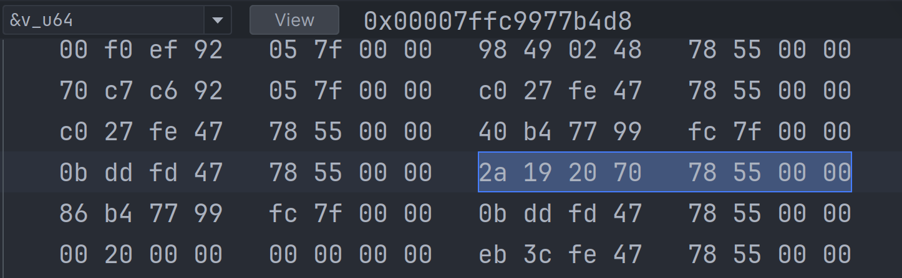
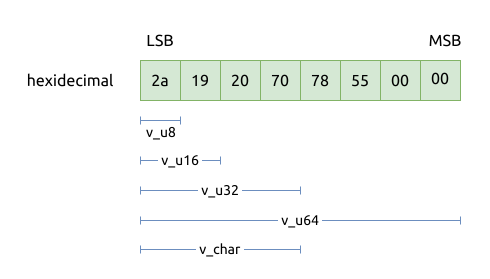

# 内存布局 Memory Layout

与结构体和枚举相比, 联合体的内存布局是最特殊的.

前面的章节提到了, 联合体的特点:

- 联合体中各个成员共享同一块内存, 其内存大小是占用内存最大的那个元素
- 当向一个成员写入值时, 可能就会把别的成员的内容给覆盖

具体是怎么共享内存的, 我们先看个例子:

```rust
{{#include assets/init.rs:5:}}
```

上面的代码中, 因为只初始化了最低位的字节, 其它 7 个字节仍然是未初始化的.
因为 `literals_t` 中的所有成员共享了8个字节的内存.

调试代码也可以发现,



注意, 当前系统是小端系统, 所以最低有效位在左侧, 最高有效位在右侧.

所以: `v_u64` 的值是 `0x0000_5578_7020_192a`, 可以发现它的最低位确实是我们事先设置的 `0x2a`,
但是其余 7 个字节都是不确定的, 因为它们没有被初始化!



总结一下:

- 初始化联合体时, 应该先将它所有字节重置为0, 再初始化某个联合体成员, 以减少未定义行为发生